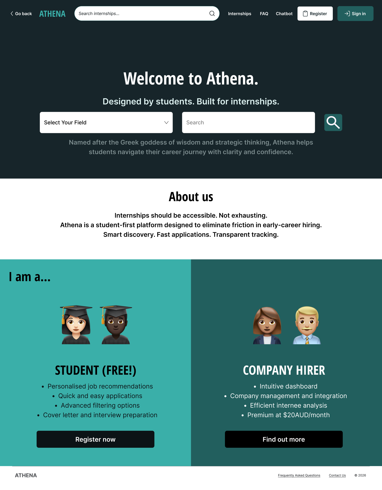

# Athena – Student Internship Management Platform

A system prototype for a two-sided internship platform designed to streamline internship discovery, application tracking, and employer candidate management.

## Prototype Preview

## Interactive Prototype

[View Interactive Figma Prototype](https://www.figma.com/design/ZdrOYbjTKltulOiJ35fODW/Athena?node-id=0-1&t=PuiOyJkLCow0NGHS-1)

## Project Overview

Athena is an internship management platform designed to improve the internship search and recruitment experience for both students and employers.

The system models the full internship lifecycle — from discovery to application, evaluation, and final hiring decisions — while providing structured visibility into each stage of the process. The prototype explores how clear role separation, structured workflows, and modular dashboard design can support scalable platform architecture.

## Tools & Technologies

- Figma
- UX/UI Prototyping
- System Design
- Frontend Architecture Concepts
- Role-Based Access Control (RBAC)
- Accessibility Design (WCAG principles)

## Key Features

- Two-sided platform design for students and employers
- Application lifecycle tracking across multiple stages
- Search and filtering system for internship discovery
- Modular dashboard layouts for scalability
- Contextual onboarding and tutorial guidance
- Accessibility features including **OpenDyslexic font support**, adjustable typography, and dark mode

## System Architecture

- **Role-Based Access Control (RBAC)** separating student and employer capabilities
- **Finite-state application lifecycle**
  - saved → applied → review → interview → offer/reject
- **Modular dashboard architecture** enabling reusable UI components
- **Query-based filtering system** supporting location, internship type, and salary ranges
- **Dynamic UI updates** based on application state transitions

## Design Principles

- **System clarity** through structured application states
- **User discoverability** via guided onboarding and contextual help
- **Accessibility-first design** aligned with WCAG principles
- **Scalable UI architecture** supporting modular component reuse

## Author

Sneha Besu  
